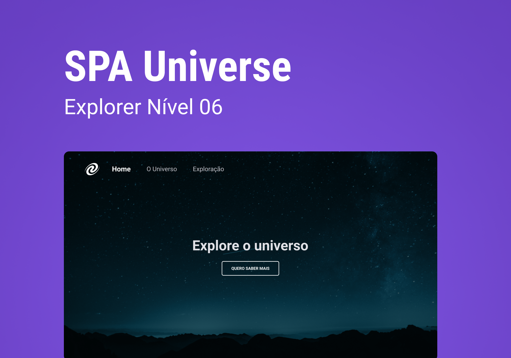

<h1 align="center">SPA Universe</h1>

  <a href="#-tecnologias">Tecnologias</a>&nbsp;&nbsp;&nbsp;|&nbsp;&nbsp;&nbsp;
  <a href="#-projeto">Projeto</a>&nbsp;&nbsp;&nbsp;|&nbsp;&nbsp;&nbsp;
  <a href="#-layout">Layout</a>

 

  

## 🚀 Tecnologias

Esse projeto foi desenvolvido com as seguintes tecnologias:

- Javascript
- HTML e CSS
- Git e Github

## 💻 Projeto

Este projeto foi desenvolvido como desafio do Stage 06: JavaScript antes do Framework, do curso Explorer da Rocketseat. Este desafio consiste em criar uma Single Page Application, utilizando os conhecimentos aprendidos no módulo:

- Conceitos de SPA;
- Mapeamento de rotas;
- Assíncrono e promises;
- Orientação a objetos;
- Classes

## 🔖 Layout

Você pode visualizar o desafio através [DESTE LINK](https://efficient-sloth-d85.notion.site/SPA-Universe-5f75e94ba7ce4292a06905eb3417420c) e o respectivo layout do Figma [NESTE LINK](https://www.figma.com/file/m8zp3mtxvwyTGQs69nIFM8/%5BDesafios-Explorer%5D-SPA-Universe/duplicate).
